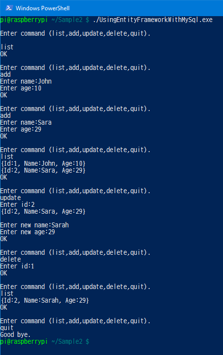
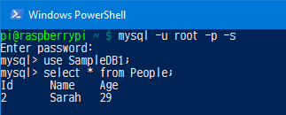

# Using Entity Framework with MySql

This sample console application was confirmed that the app can run on Windows10 x64, and Raspberry Pi Model B+ with Raspbian JESSIE LITE.

MySql version is 5.5.

**NOTICE**

When running this sample application on Raspberry Pi, 
the initialization of this app is very slowly.
